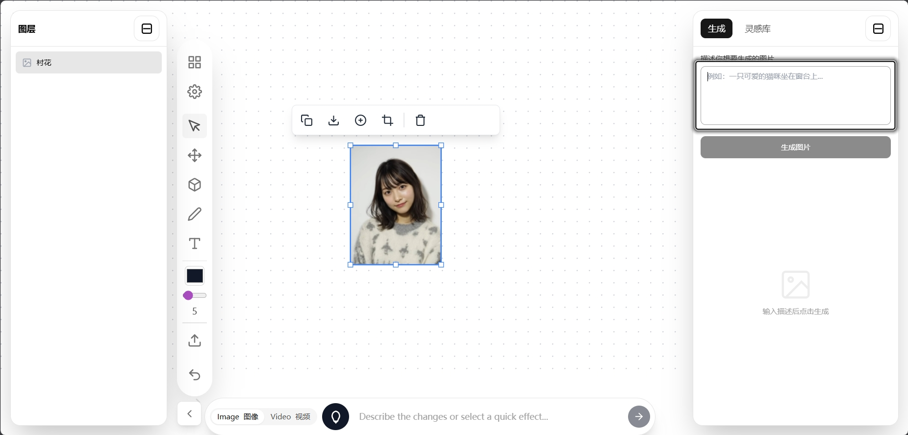

<div align="center">

# MakingLovart ｜ 创作白板

一个现代化的无限画布 AI 创作工具，为创意工作者打造的智能白板

[](https://github.com/JimLiu/nanoBanana)
[](https://lovart.com/)
[](LICENSE)

</div>

---

## ✨ 项目简介

**MakingLovart** 是一个类 [Lovart](https://lovart.com/) 的画面白板工具，基于 Web 的无限画布创作工具，结合了强大的 AI 图像生成能力和灵活的绘图功能。

> 💡 **学习项目说明**：本项目是作者以学习为目的开发的创作工具，在学习和实践中不断完善功能。欢迎各位老师和前辈指导、提出建议，帮助项目变得更好！🙏



### 🎨 设计理念

本项目基于 [**BananaPod（香蕉铺子）**](https://github.com/ZHO-ZHO-ZHO/BananaPod) 构建，这是一个基于 Nano Banana 的创意白板工具。在此基础上，我们：

- 🎯 **类 Lovart 的画面白板体验**  
  借鉴了 [Lovart](https://lovart.com/) 的 UI 设计风格，采用简洁、优雅的界面设计，注重用户体验和视觉美感。可折叠面板、流畅的动画过渡、极简主义美学等设计元素均受 Lovart 启发。

- 📚 **增强的灵感库系统**  
  在 BananaPod 的基础上，进一步增强了灵感库功能，支持角色库、场景库、道具库的分类管理，让创作素材井然有序。这是本项目的核心特色功能之一。

- 🔧 **扩展了核心功能**  
  增加了 AI 图像生成、多画板管理、图层系统等专业创作工具。

- 🌈 **定制化开发**  
  针对插画师、分镜师、概念设计师等创意工作者的实际需求，打造了一套完整的创作工作流。

**MakingLovart** 致力于为创意工作者提供一个自由的创作空间，让灵感可以无限延伸。

### 核心特性

- 🎨 **无限画布** - 类 Lovart 的自由缩放、平移的无边界创作空间
- 📚 **灵感库系统** ⭐ **核心特色** - 完整的素材管理系统
  - 分类管理：角色库、场景库、道具库
  - 一键保存 AI 生成或上传的图片
  - 拖拽使用：从灵感库直接拖到画布
  - 实时预览和重命名功能
- 🤖 **AI 图像生成** - 基于 Gemini API 的智能图像生成与编辑（需配置 API Key）
- 🖼️ **图层管理** - 完善的图层系统，支持锁定、隐藏、重命名、拖拽排序
- 🖌️ **丰富的绘图工具** - 画笔、高亮笔、橡皮擦、套索选择等
- 📐 **形状工具** - 矩形、圆形、三角形、直线、箭头
- ✂️ **图片编辑** - 裁剪、复制、移动、调整大小
- 🎬 **视频生成** - 支持从图片生成视频（实验性功能，需 API Key）
- 💾 **多画板系统** - 创建和管理多个独立的工作区
- 🎨 **UI 主题定制** - 自定义画布背景色和界面主题
- 🌐 **中英双语** - 完整的中英文界面支持
- 💾 **本地存储** - 自动保存你的创作内容和设置

---

## 🚀 快速开始

### 前置要求

- **Node.js** (推荐 v16 或更高版本)
- **Gemini API Key** - ⚠️ **使用 AI 功能时必需** - 从 [Google AI Studio](https://ai.google.dev/) 免费获取
  
  > 💡 **说明**：前端界面可以正常访问和使用（画布、绘图工具、图层管理等），但如果需要使用 AI 图像生成功能，必须配置你自己的 Gemini API Key。

### 安装步骤

1. **克隆仓库**
   ```bash
   git clone https://github.com/your-username/MakingLovart.git
   cd MakingLovart
   ```

2. **安装依赖**
   ```bash
   npm install
   ```

3. **⚠️ 配置 API Key（使用 AI 功能时必需）**
   
   本项目基于 **BananaPod** 开发，使用 **Google Gemini API** 进行 AI 图像生成。
   
   > 🔑 **重要提示**：你需要使用 **你自己的** Gemini API Key 才能使用 AI 图像生成功能。
   > 
   > 💡 **无需 API Key 也可使用**：如果不配置 API Key，你依然可以：
   > - 正常访问和使用前端界面
   > - 使用画布、绘图工具、形状工具
   > - 管理图层、使用灵感库（本地素材）
   > - 所有基础白板功能均正常工作
   > 
   > 只有当你需要使用 **AI 图像生成、编辑和视频生成**功能时，才需要配置 API Key。
   
   **配置步骤：**
   
   a. 访问 [Google AI Studio](https://ai.google.dev/) 获取 **你自己的免费** API Key
   
   b. 创建 `.env.local` 文件（如果有 `.env.example`，可复制并重命名）：
   ```bash
   # Windows
   copy .env.example .env.local
   
   # Mac/Linux
   cp .env.example .env.local
   ```
   
   c. 编辑 `.env.local` 文件，将 `YOUR_GEMINI_API_KEY` 替换为你的真实 API Key：
   ```env
   GEMINI_API_KEY=AIzaSyXXXXXXXXXXXXXXXXXXXXXXXXXXXXXXX
   ```
   
   > 💡 **提示**：API Key 格式类似 `AIzaSyXXXXXXXXXXXXXXXXXXXXXXXXXXXXXXX`
   > 
   > ⚠️ **安全提醒**：`.env.local` 文件已被 `.gitignore` 忽略，不会被提交到 Git！请勿将你的 API Key 分享给他人！

4. **启动开发服务器**
   ```bash
   npm run dev
   ```

5. **打开浏览器**
   
   访问 `http://localhost:5173` 开始创作！
   
   > ✅ **即刻体验**：无需配置 API Key，你就可以立即开始使用白板的所有基础功能。
   > 
   > 🤖 **使用 AI 功能**：当你需要使用 AI 图像生成时，请完成第 3 步的 API Key 配置。

### 🐳 Docker 部署（推荐用于生产环境）

如果你更喜欢使用 Docker，我们提供了完整的 Docker 支持，让部署变得简单快捷！

> 📖 **详细文档**: 查看 [Docker 部署完整指南](DOCKER_GUIDE.md) 了解更多高级配置和故障排查

#### 方式 1：使用 Docker Compose（推荐）

这是最简单的部署方式，一键启动：

```bash
# 1. 克隆仓库
git clone https://github.com/your-username/MakingLovart.git
cd MakingLovart

# 2. 构建并启动容器
docker-compose up -d

# 3. 访问应用
# 打开浏览器访问 http://localhost:3000
```

**或者使用 Makefile（更简单）：**

```bash
# 启动容器
make up

# 查看日志
make logs

# 停止容器
make down

# 查看所有可用命令
make help
```

**停止和管理容器：**

```bash
# 停止容器
docker-compose down

# 查看日志
docker-compose logs -f

# 重新构建并启动
docker-compose up -d --build
```

#### 方式 2：使用 Docker 命令

如果你想更精细地控制 Docker：

```bash
# 1. 构建镜像
docker build -t making-lovart:latest .

# 2. 运行容器
docker run -d \
  --name making-app \
  -p 3000:80 \
  --restart unless-stopped \
  making-lovart:latest

# 3. 访问应用
# 打开浏览器访问 http://localhost:3000
```

**容器管理命令：**

```bash
# 查看运行中的容器
docker ps

# 查看日志
docker logs -f making-app

# 停止容器
docker stop making-app

# 启动容器
docker start making-app

# 删除容器
docker rm -f making-app

# 删除镜像
docker rmi making-lovart:latest
```

#### 方式 3：从 Docker Hub 拉取（计划中）

```bash
# 拉取最新镜像（即将推出）
docker pull your-username/making-lovart:latest

# 运行容器
docker run -d -p 3000:80 your-username/making-lovart:latest
```

#### Docker 部署优势

- ✅ **一致性**: 所有环境使用相同的配置
- ✅ **简单**: 无需手动安装 Node.js 和依赖
- ✅ **快速**: 多阶段构建优化了镜像大小
- ✅ **安全**: 使用 Nginx 提供生产级别的服务
- ✅ **可靠**: 包含健康检查和自动重启

#### 自定义配置

如果需要修改端口或其他配置，编辑 `docker-compose.yml`：

```yaml
services:
  making-app:
    ports:
      - "8080:80"  # 修改为你想要的端口
```

#### 环境变量配置

如果需要在 Docker 中配置 API Key，可以：

1. **编辑 `docker-compose.yml`**：

```yaml
services:
  making-app:
    environment:
      - VITE_GEMINI_API_KEY=your_api_key_here
```

2. **或者使用 `.env` 文件**：

创建 `.env` 文件并添加：
```env
VITE_GEMINI_API_KEY=your_api_key_here
```

然后在 `docker-compose.yml` 中引用：
```yaml
services:
  making-app:
    env_file:
      - .env
```

> 💡 **提示**: 构建时的环境变量需要重新构建镜像才能生效：`docker-compose up -d --build`

#### 生产环境建议

1. **使用反向代理（如 Nginx/Caddy）**
   ```bash
   # 示例：Caddy 配置
   making.yourdomain.com {
       reverse_proxy localhost:3000
   }
   ```

2. **配置 HTTPS**
   - 使用 Let's Encrypt 获取免费 SSL 证书
   - 推荐使用 Caddy（自动 HTTPS）或 Certbot

3. **资源限制**
   - Docker Compose 配置中已包含资源限制
   - 可根据服务器配置调整

4. **监控和日志**
   ```bash
   # 查看实时日志
   docker-compose logs -f making-app
   
   # 查看资源使用
   docker stats making-app
   ```

---

## 🎯 主要功能

### 1. 无限画布创作

- **自由移动**: 使用平移工具或鼠标拖拽画布
- **缩放**: 滚轮缩放或触控板手势
- **网格对齐**: 辅助线和网格系统（规划中）

### 2. AI 图像生成

- **文本生成图像**: 输入提示词，AI 为你创作
- **图像编辑**: 选中图片，使用提示词进行智能编辑
- **局部重绘**: 框选区域进行精确编辑
- **视频生成**: 从图片生成动态视频

### 3. 灵感库

- **分类管理**: 角色库、场景库、道具库
- **一键保存**: 将生成的图片保存到灵感库
- **拖拽使用**: 从灵感库拖拽素材到画布
- **实时预览**: 悬停查看图片信息和尺寸
- **重命名**: 双击素材名称进行重命名

### 4. 绘图工具

- **画笔工具**: 自由手绘，支持笔触粗细和颜色调整
- **高亮笔**: 半透明高亮标注
- **套索工具**: 自由框选区域
- **橡皮擦**: 擦除绘制内容
- **形状工具**: 快速绘制几何图形

### 5. 图层系统

- **图层列表**: 显示所有画布元素
- **可见性控制**: 显示/隐藏图层
- **锁定保护**: 锁定图层防止误操作
- **拖拽排序**: 调整图层层级
- **重命名**: 双击图层名称进行编辑

### 6. 多画板管理

- **创建画板**: 为不同项目创建独立工作区
- **快速切换**: 在多个画板间无缝切换
- **独立保存**: 每个画板独立保存内容

---

## 🛠️ 技术栈

- **前端框架**: React + TypeScript
- **构建工具**: Vite
- **样式方案**: Tailwind CSS
- **AI 服务**: Google Gemini API
- **本地存储**: localStorage
- **国际化**: 自定义翻译系统

---

## 📂 项目结构

```
MakingLovart/
├── components/          # React 组件
│   ├── Toolbar.tsx           # 主工具栏
│   ├── PromptBar.tsx         # AI 提示词输入栏
│   ├── LayerPanelMinimizable.tsx  # 图层面板
│   ├── InspirationPanel.tsx  # 灵感库面板
│   ├── RightPanel.tsx        # 右侧多功能面板
│   ├── CanvasSettings.tsx    # 画布设置
│   ├── BoardPanel.tsx        # 画板管理
│   └── ...
├── services/           # 服务层
│   └── geminiService.ts      # Gemini API 集成
├── utils/              # 工具函数
│   ├── fileUtils.ts          # 文件处理
│   ├── assetStorage.ts       # 素材存储
│   └── translations.ts       # 国际化
├── types.ts            # TypeScript 类型定义
├── App.tsx             # 主应用组件
├── main.tsx            # 应用入口
├── index.html          # HTML 模板
├── vite.config.ts      # Vite 配置
└── package.json        # 项目依赖
```

---

## 🎨 使用场景

- **插画创作**: 快速生成参考图并在画布上自由组合
- **分镜设计**: 创建动画或影视分镜，管理角色、场景、道具素材
- **概念设计**: 头脑风暴时快速可视化想法
- **原型设计**: 结合 AI 和手绘快速制作设计原型
- **教学演示**: 无限画布适合展示和讲解复杂概念

---

## 🔧 开发指南

### 构建生产版本

```bash
npm run build
```

构建产物将生成在 `dist/` 目录。

### 代码规范

项目使用 ESLint 进行代码检查：

```bash
npm run lint
```

### 类型检查

```bash
npm run type-check
```

---

## 🚧 开发计划

- [ ] 协作功能（多人实时编辑）
- [ ] 云端同步
- [ ] 更多 AI 模型支持
- [ ] 插件系统
- [ ] 移动端优化
- [ ] 键盘快捷键系统
- [ ] 撤销/重做优化
- [ ] 导出为图片/PDF
- [ ] 模板库

---

## 🤝 贡献

本项目是以学习为目的开发的，欢迎各位老师、前辈和同学提出宝贵意见和建议！🙏

**欢迎：**
- 💡 提出功能建议和改进意见
- 🐛 报告 Bug 和问题
- 📖 完善文档和注释
- 🔧 提交代码优化和新功能
- 🎓 分享使用经验和最佳实践

**贡献流程：**

1. Fork 本仓库
2. 创建你的特性分支 (`git checkout -b feature/AmazingFeature`)
3. 提交你的改动 (`git commit -m 'Add some AmazingFeature'`)
4. 推送到分支 (`git push origin feature/AmazingFeature`)
5. 开启 Pull Request

详见 [贡献指南](CONTRIBUTING.md)

---

## 📄 开源协议

本项目采用 MIT 协议 - 详见 [LICENSE](LICENSE) 文件

---

## 🙏 致谢与灵感来源

本项目站在巨人的肩膀上，特别感谢以下项目和团队：

### 核心基础
- **[BananaPod（香蕉铺子）](https://github.com/ZHO-ZHO-ZHO/BananaPod)** - 本项目基于 @ZHO-ZHO-ZHO 的 BananaPod 构建，这是一个优秀的创意白板工具
- **[Nano Banana](https://github.com/JimLiu/nanoBanana)** - BananaPod 的底层基础，感谢 @JimLiu 提供的无限画布编辑器框架

### UI 设计灵感
- **[Lovart](https://lovart.com/)** - 现代化、优雅的 UI 设计风格深深启发了本项目的界面设计
  - 可折叠侧边栏面板的设计
  - "传送门"式的平滑展开/收起动画
  - 简洁的工具栏布局
  - 灵感库的瀑布流展示
  - 输入框的动态宽度调整
  - 整体的白色极简主义美学

### 技术支持
- **[Google Gemini](https://ai.google.dev/)** - 强大的 AI 能力支持
- **[React](https://react.dev/)** - 优秀的前端框架
- **[Vite](https://vitejs.dev/)** - 快速的构建工具
- **[Tailwind CSS](https://tailwindcss.com/)** - 便捷的样式方案


---

<div align="center">

**如果这个项目对你有帮助，请给个 ⭐️ Star 支持一下！**

Made with ❤️ for Creative Minds

[Report Bug](../../issues) · [Request Feature](../../issues)

</div>
