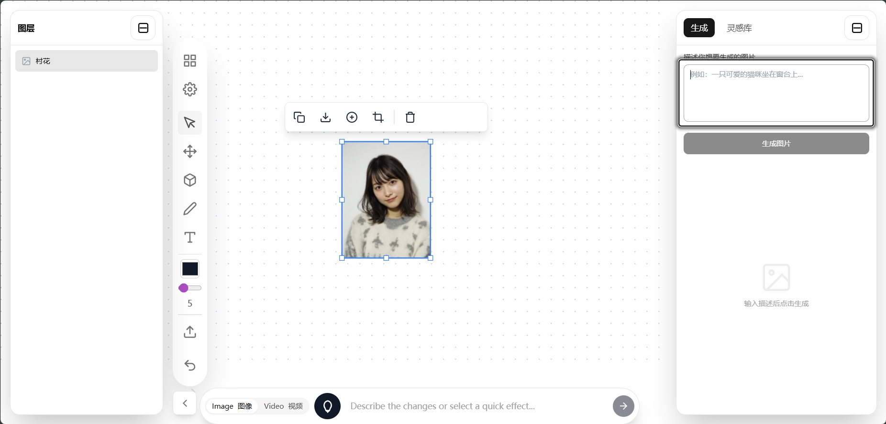

<div align="center">

# MakingLovart | Creative Whiteboard

A modern AI-powered infinite canvas designed for creative professionals.

[](https://github.com/JimLiu/nanoBanana)
[](https://lovart.com/)
[](LICENSE)

**[🇨🇳 中文文档](DOCKER_GUIDE.md#-中文文档)** · **[🇬🇧 English](#project-overview)**

</div>

---

## Project overview

MakingLovart is a web-based infinite canvas inspired by Lovart. It combines flexible drawing tools, a layered workspace and an organized inspiration library with AI-driven image/video generation (via Google Gemini) to accelerate creative workflows.

This repo is a learning project — contributions and feedback are welcome.



## Highlights

- Minimalist Lovart-inspired UI with collapsible panels
- Organized inspiration library (Characters, Scenes, Props)
- Gemini-powered AI: text→image, image editing, inpainting, experimental video
- Layer system: lock, hide, rename, reorder
- Multiple boards with local auto-save

## Quick start

Prerequisites: Node.js v16+ (recommended).

1) Clone and install

```bash
git clone https://github.com/your-username/MakingLovart.git
cd MakingLovart
npm install
```

2) (Optional) Configure Gemini API key

Add your key to `.env.local` (copy from `.env.example`) or set `VITE_GEMINI_API_KEY` in your environment.

3) Run development server

```bash
npm run dev
```

Open http://localhost:5173

## Docker

A full bilingual Docker guide is available in `DOCKER_GUIDE.md` (includes Chinese and English sections, Nginx/Caddy/Traefik examples and common troubleshooting).

## Tech stack

- React + TypeScript
- Vite
- Tailwind CSS
- Google Gemini (AI)
- localStorage for persistence

## Contributing

Fork, create a branch, commit, push and open a PR. See `CONTRIBUTING.md` for details.

## Credits

- BananaPod — base project: https://github.com/ZHO-ZHO-ZHO/BananaPod
- Nano Banana — canvas engine: https://github.com/JimLiu/nanoBanana
- Lovart — UI inspiration: https://lovart.com/

---

<div align="center">

If this project helps you, please give it a ⭐️

[Report Bug](../../issues) · [Request Feature](../../issues)

</div>
