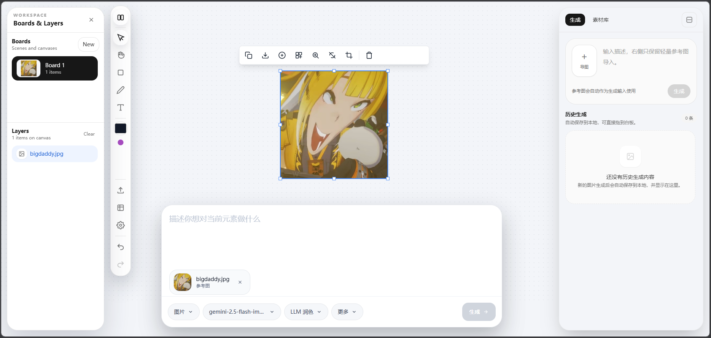

<div align="center">
<<<<<<< Updated upstream

# MakingLovart | Creative Whiteboard

A modern AI-powered infinite canvas designed for creative professionals.
=======

# MakingLovart

**An open-source, AI-powered infinite canvas for visual creation**

一个开源的 AI 无限画布创作工具
>>>>>>> Stashed changes

[](https://github.com/JimLiu/nanoBanana)
[](https://lovart.com/)
[](LICENSE)
<<<<<<< Updated upstream

**[🇨🇳 中文文档](DOCKER_GUIDE.md#-中文文档)** · **[🇬🇧 English](#project-overview)**

</div>

---

## Project overview

MakingLovart is a web-based infinite canvas inspired by Lovart. It combines flexible drawing tools, a layered workspace and an organized inspiration library with AI-driven image/video generation (via Google Gemini) to accelerate creative workflows.

This repo is a learning project — contributions and feedback are welcome.


## Highlights

- Minimalist Lovart-inspired UI with collapsible panels
- Organized inspiration library (Characters, Scenes, Props)
- Gemini-powered AI: text→image, image editing, inpainting, experimental video
- Layer system: lock, hide, rename, reorder
- Multiple boards with local auto-save

## Quick start

Prerequisites: Node.js v16+ (recommended).

1) Clone and install

```bash
git clone https://github.com/your-username/MakingLovart.git
cd MakingLovart
npm install
```

2) (Optional) Configure Gemini API key

Add your key to `.env.local` (copy from `.env.example`) or set `VITE_GEMINI_API_KEY` in your environment.

3) Run development server

```bash
npm run dev
```

Open http://localhost:5173

## Docker

A full bilingual Docker guide is available in `DOCKER_GUIDE.md` (includes Chinese and English sections, Nginx/Caddy/Traefik examples and common troubleshooting).

## Tech stack

- React + TypeScript
- Vite
- Tailwind CSS
- Google Gemini (AI)
- localStorage for persistence

## Contributing

Fork, create a branch, commit, push and open a PR. See `CONTRIBUTING.md` for details.

## Credits

- BananaPod — base project: https://github.com/ZHO-ZHO-ZHO/BananaPod
- Nano Banana — canvas engine: https://github.com/JimLiu/nanoBanana
- Lovart — UI inspiration: https://lovart.com/

---

<div align="center">

If this project helps you, please give it a ⭐️

[Report Bug](../../issues) · [Request Feature](../../issues)

=======
[](../../pulls)

**[English](#-overview)** · **[中文文档](DOCKER_GUIDE.md#-中文文档)**



</div>

---

## ⚡ Overview

MakingLovart is an infinite canvas whiteboard that combines freehand drawing, layer management, a categorized asset library and multi-model AI generation into a single workspace. Think [Lovart](https://lovart.com/) meets Figma, with built-in Gemini / OpenAI / Qwen / Stability support.

> **Note:** This is an educational project — all feedback, issues and PRs are welcome.

### What you can do

- **Draw freely** — brushes, highlighter, lasso, shapes, arrows, text
- **Manage layers** — lock, hide, rename, drag-to-reorder; group / ungroup
- **Organize inspiration** — Characters · Scenes · Props library with drag-and-drop to canvas
- **Generate with AI** — text→image, image editing, inpainting, prompt enhancement, experimental video (Veo 2.0)
- **Run node workflows** — visual node editor for chaining AI generation steps
- **Work across boards** — multiple independent boards, each auto-saved locally
- **Use @ mentions** — reference canvas elements in prompts via rich-text `@mention` syntax
- **Switch languages** — full English / 中文 interface

---

## 🚀 Quick Start

### Prerequisites

| Tool | Version |
|------|---------|
| Node.js | 16+ |
| npm | 7+ |

### Install & Run

```bash
git clone https://github.com/Paker-kk/MakingLovart.git
cd MakingLovart
npm install
npm run dev
```

Open **http://localhost:5173** — the whiteboard works immediately, no API key required.

### Enable AI Features (optional)

```bash
copy .env.example .env.local
```

Edit `.env.local`:

```env
VITE_GEMINI_API_KEY=your_gemini_key
```

Or configure keys for OpenAI / Qwen / Stability / Banana in the in-app Settings panel.

> Whiteboard, drawing, layers, inspiration library — all work without any API key.

---

## 🐳 Docker

```bash
docker-compose up -d        # http://localhost:3000
```

Full deployment guide (Nginx / Caddy / Traefik, resource limits, troubleshooting):
📖 **[DOCKER_GUIDE.md](DOCKER_GUIDE.md)**

---

<<<<<<< Updated upstream
## 🎨 Features
=======
### 🔑 多 Provider API 管理
- 支持 **Google (Gemini/Imagen/Veo)**、**OpenAI (GPT/DALL-E)**、**Anthropic (Claude)**、**Stability (SDXL)**、**Qwen**、**Banana**、**RunningHub** 等多家 AI 服务
- 按 Provider 自动推断可用模型，底部输入栏只显示已配置的模型
- API Key 验证 + 状态指示 + 生成前预检
>>>>>>> Stashed changes

| Category | Details |
|----------|---------|
| **Canvas** | Infinite pan & zoom, snap guides, custom background |
| **Drawing** | Pencil, highlighter, eraser, lasso, rectangle, circle, triangle, arrow, line, text |
| **Layers** | Visibility toggle, lock, rename, drag reorder, grouping |
| **Inspiration Library** | Characters / Scenes / Props tabs, drag-to-canvas, rename, AI-generate into library |
| **AI Generation** | Text→image (Gemini, Imagen 4, DALL·E, Qwen), image editing, inpainting, prompt enhance |
| **Video** | Experimental image→video via Veo 2.0 |
| **Node Workflow** | Visual node editor for chaining prompt → generate → edit steps |
| **Rich Prompt** | TipTap editor with `@mention` to reference canvas elements |
| **Quick Prompts** | 25+ built-in prompt templates (figure, cosplay, line art, Funko Pop, LEGO, etc.) |
| **Multi-board** | Independent boards with auto-save to localStorage |
| **i18n** | English + 中文 |
| **Multi-model** | Google Gemini, OpenAI, Anthropic, Qwen, Stability AI, Banana — configurable per capability |

---

## 🏗️ Tech Stack

<<<<<<< Updated upstream
- **Framework:** React 19 + TypeScript
- **Build:** Vite 6
- **Styling:** Tailwind CSS
- **Rich Text:** TipTap (mention / prompt editor)
- **AI SDK:** `@google/genai` + OpenAI-compatible gateway
- **Storage:** localStorage (boards, assets, settings)
=======
| Layer | Technology |
|-------|-----------|
| **Framework** | React 19 + TypeScript 5.8 |
| **Build** | Vite 6 |
| **Rich Text** | Tiptap 3 (@mention, suggestion) |
| **AI SDK** | @google/genai (Gemini, Imagen, Veo) |
| **Multi-Provider** | OpenAI, Anthropic, Stability, Qwen, Banana, RunningHub |
| **Styling** | Tailwind CSS + CSS Custom Properties |
| **Deployment** | Docker + Nginx / Vercel / Static |
>>>>>>> Stashed changes

---

## 📂 Project Structure

```
MakingLovart/
├── App.tsx                    # Main app (canvas, state, rendering)
├── types.ts                   # Shared TypeScript types
├── translations.ts            # i18n (EN / ZH)
├── components/
<<<<<<< Updated upstream
│   ├── Toolbar.tsx            # Drawing & shape tools
│   ├── PromptBar.tsx          # AI prompt input
│   ├── RichPromptEditor.tsx   # TipTap @mention editor
│   ├── InspirationPanel.tsx   # Asset library (characters / scenes / props)
│   ├── WorkspaceSidebar.tsx   # Board list + layer panel
│   ├── NodeWorkflowPanel.tsx  # Visual node workflow editor
│   ├── CanvasSettings.tsx     # Canvas background & preferences
│   └── ...
=======
│   ├── PromptBar.tsx          # 底部智能输入栏（模式切换、模型选择、@mention）
│   ├── Toolbar.tsx            # 左侧工具栏（绘制、形状、文字等）
│   ├── WorkspaceSidebar.tsx   # 左侧面板（画板管理 + 图层面板）
│   ├── RightPanel.tsx         # 右侧面板（生成设置 + 灵感/素材库）
│   ├── CanvasSettings.tsx     # 设置面板 & API Key 管理
│   ├── LayerPanel.tsx         # 图层管理面板
│   ├── InspirationPanel.tsx   # 灵感 & 历史面板
│   ├── AssetLibraryPanel.tsx  # 素材库面板
│   ├── BoardPanel.tsx         # 画板管理面板
│   ├── RichPromptEditor.tsx   # Tiptap 富文本编辑器
│   ├── CanvasMentionExtension.tsx  # @mention 扩展
│   ├── MentionList.tsx        # @mention 下拉列表
│   ├── QuickPrompts.tsx       # 快捷提示词模板
│   ├── ConfigManager/         # API Key 配置管理组件
│   └── nodeflow/              # 节点编辑器内核
├── pages/
│   └── workflow/              # 当前运行中的节点工作流页面与状态
>>>>>>> Stashed changes
├── services/
│   ├── geminiService.ts       # Gemini / Imagen / Veo API
│   ├── aiGateway.ts           # OpenAI / Qwen / Stability / Anthropic router
│   └── bananaService.ts       # Banana split-layer & agent API
├── utils/
│   ├── assetStorage.ts        # Inspiration library persistence
│   ├── generationHistory.ts   # AI generation history
│   └── fileUtils.ts           # File / DataURL helpers
├── DOCKER_GUIDE.md            # Docker deployment (CN + EN)
├── CONTRIBUTING.md
└── LICENSE
```

---

## 🗺️ Roadmap

- [ ] Real-time multi-user collaboration
- [ ] Cloud sync & backup
- [ ] More AI models (Stable Diffusion XL, Flux, etc.)
- [ ] Plugin / extension architecture
- [ ] Export to PDF / high-res image
- [ ] Mobile & tablet optimization

RunningHub 已接入文生图、参考图编辑和局部重绘。配置时需要填写 32 位 API Key，文生图 App ID、图生图 App ID、局部重绘 App ID，以及图片参数名和遮罩参数名；参考图和白板遮罩都会以 data URI 形式自动注入对应字段，运行地址、查询地址、上传地址由应用自动使用平台固定链接。

### RunningHub 配置说明

在应用内打开 设置 → API 配置 → 添加 API Key，Provider 选择 RunningHub 后，建议按下面方式填写：

- API Key：RunningHub 后台生成的 32 位 Access Key
- 文生图 App ID：用于纯提示词出图的 AI App ID
- 图生图 App ID：用于参考图编辑或多图合成的 AI App ID
- 局部重绘 App ID：用于白板遮罩重绘的 AI App ID
- 图片参数名：你的图生图或局部重绘工作流中接收图片数组的字段名，默认是 images
- 遮罩参数名：你的局部重绘工作流中接收遮罩图片的字段名，默认是 mask
- 高级节点映射：可选配置提示词、模型、比例、提示词类型对应的 nodeId 和 fieldName；如果你的工作流不是文档示例结构，需要在这里对齐
- 默认模型：当前内置为文档示例中的 Midjourney / Niji 模型选项
- 默认比例：会映射到 RunningHub 工作流里的 aspect_rate 字段
- instanceType：default 或 plus
- usePersonalQueue：是否启用个人独占队列
- retainSeconds：可选，适合企业共享队列复用实例
- webhookUrl：可选，任务完成后回调

当前版本的运行逻辑如下：

- 文生图：调用固定地址 /openapi/v2/run/ai-app/{文生图 App ID}
- 图生图：调用固定地址 /openapi/v2/run/ai-app/{图生图 App ID}
- 局部重绘：调用固定地址 /openapi/v2/run/ai-app/{局部重绘 App ID}
- 查询状态：统一调用 /openapi/v2/query
- 本地文件上传：统一调用 /openapi/v2/media/upload/binary

如果你的 RunningHub 工作流不是文档示例那套节点结构，现在可以直接在高级节点映射里改 nodeId、fieldName，以及可选的 fieldData JSON。

---

## 🤝 Contributing

1. Fork → branch → commit → PR
2. Run `npm run dev` to verify locally
3. Keep PRs focused and well-described

See **[CONTRIBUTING.md](CONTRIBUTING.md)** for full guidelines.

---

## 🙏 Credits

- **[BananaPod](https://github.com/ZHO-ZHO-ZHO/BananaPod)** — the original creative whiteboard by @ZHO-ZHO-ZHO
- **[Nano Banana](https://github.com/JimLiu/nanoBanana)** — infinite canvas engine by @JimLiu
- **[Lovart](https://lovart.com/)** — UI/UX design inspiration

---

## 📄 License

[MIT](LICENSE) © MakingLovart Contributors

---

<div align="center">

If this project helps you, please ⭐ the repo — it means a lot!

[Report Bug](../../issues) · [Request Feature](../../issues)

>>>>>>> Stashed changes
</div>
