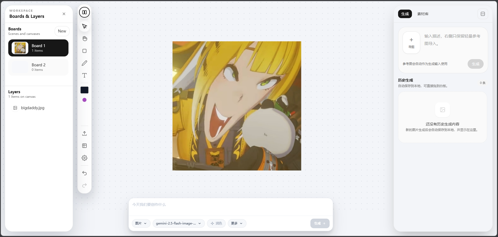

<p align="center">
  
</p>

<h1 align="center">🔴 Flovart</h1>

<p align="center">
  <strong>BYOK AI Design Studio — Your Keys, All Models, One Canvas</strong>
</p>

<p align="center">
  <em>自带 API Key，接入所有主流 AI 模型，在无限画布上创作图片、视频和设计</em>
</p>

<p align="center">
  <a href="#-chrome-extension">Chrome Extension</a> •
  <a href="#-quick-start">Quick Start</a> •
  <a href="#-features">Features</a> •
  <a href="#-desktop-app">Desktop App</a> •
  <a href="#-deployment">Deployment</a>
</p>

<p align="center">
  
  
  
  
  
  
</p>

---

## 🔥 Why Flovart?

| | Midjourney / DALL-E | Lovart | **Flovart** |
|---|---|---|---|
| 计费方式 | 平台订阅制 | 平台订阅制 | **BYOK — 用你自己的 API Key，零平台费** |
| 模型选择 | 只能用自家模型 | 限定模型 | **Gemini / DALL-E / SDXL / Claude / Qwen 自由切换** |
| 工作流 | 聊天框出图 | 网页设计工具 | **无限画布 + 设计 Agent + 节点工作流** |
| 部署形态 | SaaS only | SaaS only | **浏览器插件 / 桌面 App / 自部署 Web** |
| 数据隐私 | 图片上传到平台 | 图片上传到平台 | **API Key 本地存储，图片不经过任何中间服务器** |

> **一句话说清楚**：Flovart 是一个 **自带密钥的 AI 设计工作台** —— 你用自己的 API Key 接入 Gemini、DALL-E、Stable Diffusion 等模型，在无限画布上生成图片、编辑图片、生成视频，还能用 AI Agent 自动完成设计任务。**Chrome 插件一键安装，开箱即用。**

---

## 🧩 Chrome Extension

Flovart 的核心交付形态是 **Chrome 浏览器插件**（Manifest V3）。

### 安装方式

**开发者模式（当前）**：
1. 克隆仓库并构建：
   ```bash
   git clone https://github.com/Paker-kk/Flovart.git
   cd Flovart
   npm install
   npm run ext:build
   ```
2. 打开 Chrome → `chrome://extensions/`
3. 开启右上角「开发者模式」
4. 点击「加载已解压的扩展程序」→ 选择 `dist-extension/` 目录

**Chrome Web Store（即将上线）**：
> 正在准备提交 Chrome Web Store 审核，敬请期待。

### 插件功能
- 🖼️ 点击插件图标，打开完整 AI 画布工作台
- 🔑 BYOK —— 在插件内配置你自己的 API Key
- 🖱️ 右键任意网页图片 → 直接发送到画布进行 AI 编辑
- 🤖 Multi-Agent 协作，AI 自动完成设计任务
- 📦 所有数据存储在浏览器本地，零服务器依赖

---

## 🚀 Quick Start（Web 版）

### 前置条件
- **Node.js** ≥ 18
- 至少一个 AI API Key（推荐 [Google Gemini](https://aistudio.google.com/apikey)，免费）

### 安装 & 运行

```bash
git clone https://github.com/Paker-kk/Flovart.git
cd Flovart

npm install

# 配置 API Key
cp env.example .env
# 编辑 .env，填入你的 GEMINI_API_KEY

npm run dev
```

打开 [http://localhost:3000](http://localhost:3000) 开始创作 🎉

---

## 🎯 Features

### 🖌️ 无限画布
- 无限缩放与平移的白板画布
- 自由绘制、形状、文字、箭头、线条等基础工具
- 多元素选择、对齐辅助线、图层管理
- 亮色 / 暗色主题自适应

### 🤖 AI 生成
- **文生图**：输入提示词，Gemini / DALL-E / SDXL 直接生成图片到画布
- **图生图**：选中画布上的图片 + 提示词 → AI 编辑
- **文生视频**：Veo 2.0 视频生成，支持 16:9 / 9:16
- **首尾帧动画**：选中起始帧图片，Veo 自动生成过渡动画
- **提示词润色**：一键开关，生成前用 LLM 自动优化提示词

### 📎 @Mention 引用
- 在输入框 `@` 引用画布上任意元素作为参考图
- 视频模式优先使用选中图片或首张 @引用图作为参考帧

### 🔑 多 Provider BYOK
- 支持 **Google (Gemini 3/Imagen 4/Veo 3.1)**、**OpenAI (GPT-5.4)**、**Anthropic (Claude 4.x)**、**DeepSeek**、**Qwen**、**Banana**
- 按 Provider 自动推断可用模型
- API Key 验证 + 状态指示 + 生成前预检

### 🤖 设计 Agent
- AI 智能体自动分析画布内容，给出设计建议
- 多步骤自动化设计工作流
- 节点编辑器可视化编排 AI 工作流

### 🎭 角色锁定
- 锁定参考角色图片，后续生成保持面部/服装/体态一致性

### 📦 素材库
- 角色 / 场景 / 道具分类管理
- 生成历史自动记录 + 一键拖入画布

### 🌐 国际化
- 中文 / English 双语支持

---

## 🏗️ Tech Stack

| Layer | Technology |
|-------|-----------|
| **Framework** | React 19 + TypeScript 5.8 |
| **Build** | Vite 6 |
| **Desktop** | Tauri v2 (Rust) |
| **Extension** | Chrome Manifest V3 |
| **Rich Text** | Tiptap 3 (@mention, suggestion) |
| **AI SDK** | @google/genai (Gemini, Imagen, Veo) |
| **Multi-Provider** | OpenAI, Anthropic, DeepSeek, Qwen, Banana |
| **Styling** | Tailwind CSS 4 + CSS Custom Properties |

---

## 📁 Project Structure

```
Flovart/
├── index.tsx                  # 应用入口
├── App.tsx                    # 主应用（画布、状态、AI 生成逻辑）
├── types.ts                   # 全局类型定义
├── translations.ts            # 国际化文案（中/英双语）
├── styles.css                 # 全局样式 & CSS 变量
│
├── components/                # UI 组件层
│   ├── PromptBar.tsx          # 底部输入栏（模式切换、模型选择、@mention）
│   ├── Toolbar.tsx            # 左侧工具栏
│   ├── WorkspaceSidebar.tsx   # 左侧面板（画板 + 图层）
│   ├── RightPanel.tsx         # 右侧面板（生成设置 + 素材库）
│   ├── CanvasSettings.tsx     # 设置面板 & API Key 管理
│   ├── AgentChatPanel.tsx     # AI Agent 对话面板
│   ├── NodeWorkflowPanel.tsx  # 节点工作流面板
│   ├── OnboardingWizard.tsx   # 新用户引导向导
│   ├── ConfigManager/         # API Key 配置管理
│   └── nodeflow/              # 节点编辑器内核
│
├── services/                  # AI 服务层
│   ├── aiGateway.ts           # 多 Provider 路由网关
│   ├── geminiService.ts       # Google Gemini/Imagen/Veo 封装
│   ├── bananaService.ts       # Banana Vision Agent
│   ├── agentOrchestrator.ts   # 设计 Agent 编排器
│   └── workflowEngine.ts     # 工作流引擎
│
├── utils/                     # 工具函数
│   ├── assetStorage.ts        # 素材持久化
│   ├── generationHistory.ts   # 生成历史管理
│   ├── keyVault.ts            # API Key 安全存储
│   └── uiScale.ts            # 响应式缩放
│
├── extension/                 # Chrome 插件源码
│   ├── manifest.json          # Manifest V3 配置
│   ├── background/            # Service Worker
│   ├── content/               # Content Script + CSS
│   ├── popup/                 # 弹窗 UI
│   └── build.mjs             # 插件构建脚本
│
├── src-tauri/                 # Tauri 桌面端
│   ├── tauri.conf.json        # Tauri 配置
│   ├── Cargo.toml             # Rust 依赖
│   └── src/                   # Rust 后端代码
│
├── tests/                     # 自动化测试
├── .github/workflows/         # CI/CD
│   ├── build-desktop.yml      # Tauri 桌面应用自动构建 & Release
│   └── deploy-pages.yml       # GitHub Pages 自动部署
│
├── Dockerfile                 # Docker 构建
├── docker-compose.yml         # Docker Compose
└── nginx.conf                 # Nginx 生产配置
```

---

## 🖥️ Desktop App

基于 [Tauri v2](https://tauri.app/) 打包为原生桌面应用（安装包仅 ~3-5MB）。

### 本地构建

```bash
# 前提：Node.js 18+ / Rust 1.80+
npm install
npm run tauri:dev     # 开发模式（热更新）
npm run tauri:build   # 生产构建
```

构建产物：
- **Windows**: `Flovart_x.x.x_x64-setup.exe` / `.msi`
- **macOS**: `.dmg` / `.app`
- **Linux**: `.deb` / `.AppImage`

### GitHub Actions 自动构建

推送 `v*` 格式的 Git tag 即可触发全平台自动构建并发布到 GitHub Releases：

```bash
git tag v0.1.0
git push origin v0.1.0
```

**首次使用前需配置**（一次性）：

1. **生成签名密钥**（本地执行）：
   ```powershell
   npm run tauri signer generate -- -w ~/.tauri/flovart.key
   ```
   记下输出的**公钥字符串**，并保存好生成的私钥文件。

2. **配置 GitHub Secrets**（仓库 Settings → Secrets and variables → Actions）：
   | Secret 名称 | 值 |
   |---|---|
   | `TAURI_SIGNING_PRIVATE_KEY` | 私钥文件的完整内容 |
   | `TAURI_SIGNING_PRIVATE_KEY_PASSWORD` | 密码（无密码则留空） |

3. 推送 tag，等待 Actions 完成，去 Releases 页面发布。

> 构建完成后 Release 为草稿状态，需手动点击 "Publish release" 发布。

---

## 🌐 Deployment（Web 版）

### GitHub Pages（当前）

推送到 `main` 分支自动部署到 GitHub Pages。

访问地址：`https://paker-kk.github.io/Flovart/`

### Docker

```bash
docker-compose up -d
# 访问 http://localhost:3000
```

### 静态构建

```bash
npm run build
# 产物在 dist/，部署到任意静态服务（Vercel / Netlify / Cloudflare Pages / Nginx）
```

> 📖 Docker 详细指南：[DOCKER_GUIDE.md](./DOCKER_GUIDE.md)

---

## ⚙️ Configuration

```env
# .env 文件（或在应用内设置 → API 配置中添加）
VITE_GEMINI_API_KEY=your_gemini_api_key_here
```

支持在应用内动态添加任意 Provider 的 API Key，无需重启。

---

## 🤝 Contributing

1. **Fork** 本仓库
2. 创建特性分支 (`git checkout -b feature/amazing-feature`)
3. 提交更改 (`git commit -m 'Add amazing feature'`)
4. 推送分支 (`git push origin feature/amazing-feature`)
5. 打开 **Pull Request**

> [CONTRIBUTING.md](./CONTRIBUTING.md) · [CODE_OF_CONDUCT.md](./CODE_OF_CONDUCT.md)

---

## 🙏 Acknowledgments

- **[BananaPod](https://github.com/ZHO-ZHO-ZHO/BananaPod)** — AI 视觉智能体
- **[LOVART](https://lovart.ai)** — AI 创意设计平台

---

## ⭐ Star

如果 Flovart 对你有帮助，**给个 Star** ⭐ 支持一下！

[](https://star-history.com/#Paker-kk/Flovart&Date)

---

## 📄 License

[Apache License 2.0](./LICENSE)
